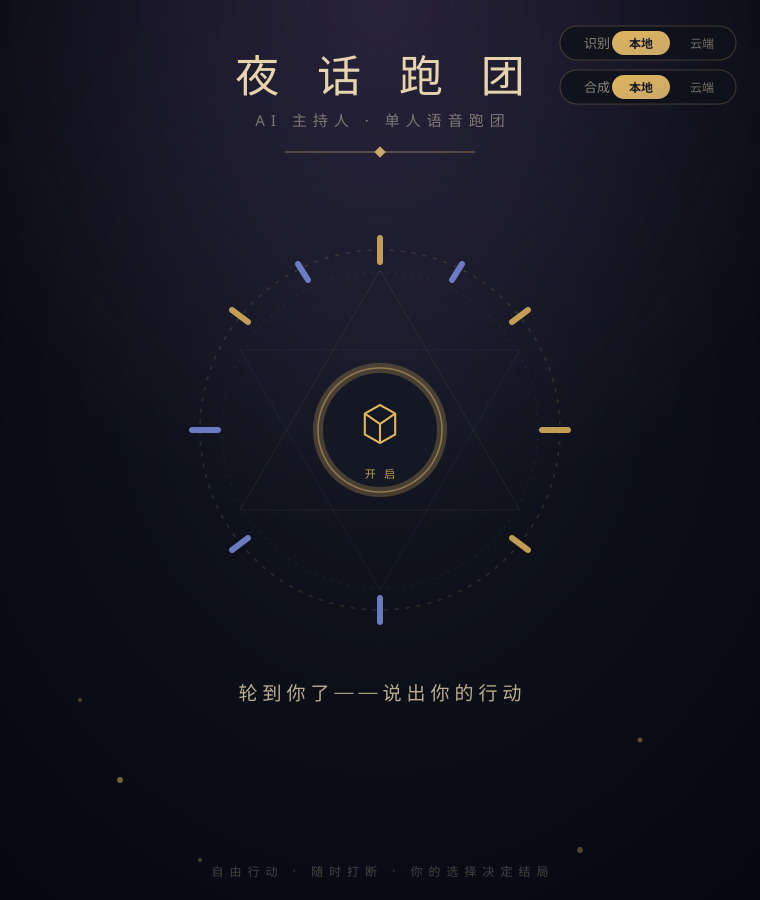

# ai-TRPG · AI 单人语音跑团

用语音和 AI 主持人（DM/Keeper）玩一场 20–45 分钟的单人跑团。
开口说话就能玩：AI 先以「剧本推荐员」身份帮你选本，然后切换成该剧本的
专属主持人，带完整局——叙事、扮演 NPC、掷骰判定、多结局收尾，最后复盘点评。

<p align="center">
  
</p>

悬疑奇幻风格的「夜话跑团」主题界面。

## 玩法

```
你接入 → 推荐员接待（聊偏好、介绍剧本）
       → 你选定剧本 → 主持人登场，念开场白
       → 自由行动：探索 / 对话 / 判定 / 作死
       → 达成结局 → 复盘点评 → 回到推荐员，换本再来
```

- **玩法完全自由**：没有选项列表，想到什么说什么。撬锁、套话、翻窗、
  掉头就跑——主持人按你的意图叙事，需要判定时由代码真实掷骰（AI 不编点数）。
- **随时打断**：主持人叙述中你随时可以插话（「等等，我不这么做」「我直接问她」），
  它会顺着你的新意图继续，不会重播整段。长段叙述有防误触保护（持续说话 0.5 秒才打断）。
- **主持人有记忆**：你 40 分钟前拿到的钥匙、说过的话，它都记得（滑窗 + 滚动摘要 + 结构化事实三层记忆）。
- **每个 NPC 都有自己的声音**：本地 TTS 下不同 NPC 用不同音色朗读，
  情绪随剧情变化（愤怒、低语、悲伤……）。
- **中途可以换本**：直接说「我不想玩这个了，换幼龙洞穴」，主持人会真的切换。

## 快速开始（部署）

**先想好部署形态：纯云端（无显卡也能玩，ASR/TTS 走火山引擎 API）还是
本地+云端混合（有 N 卡推荐，本地识别 + 本地多音色合成，免 API 费用）。**

然后把 `DEPLOY.md` 交给你的 AI 助手，说一句
「读 DEPLOY.md 帮我部署这个项目，采用本地+云端部署」（或「……采用纯云端部署」）即可。

部署指南会先扫描你的显卡（`nvidia-smi`）核对形态：

- **纯云端**：装最小依赖、跳过所有模型下载，最后配好 `.env` 里的 key 就能跑。
- **本地+云端混合**：本地 sherpa 识别 + 本地 CosyVoice2 合成
  （多音色、带情绪、免 API 费用），指南会按显存选好参数档位。

手动部署也只需：Python 3.10 → 装依赖 → 下模型 → 配 `.env` →
`python -m voice.web_server --config configs/trpg.json`，细节全在 [DEPLOY.md](DEPLOY.md)。

## 配置说明

### LLM（必需，云端）

默认走 Kimi（`kimi-for-coding-highspeed`），`.env` 里配 `KIMI_API_KEY`，
`configs/*.json` 的 `kimi` 段可调模型名 / `reasoning_effort` / `max_tokens`。

**想换其他大模型**（GPT、DeepSeek、Claude、本地 vLLM……）：把
`voice/llm/base.py` 的 Protocol 和 `voice/llm/kimi.py` 丢给你的 AI 助手，
说「照这个接口给我加一个 xxx provider」，再在 `voice/llm/__init__.py`
工厂里注册即可——所有智能都在服务端，前端零改动。

### ASR（语音识别）：本地 / 云端一键切换

网页右上角有「识别 / 合成」两组开关，**运行中可实时切换**（本地模型首次加载要数秒）。

- **本地 sherpa**（默认）：中英双语流式识别，CPU 就能跑，零费用。
- **云端火山引擎**：
  1. 到 [火山引擎控制台](https://console.volcengine.com) → 语音技术，
     分别**开通「语音识别」和「语音合成」**服务；
  2. 创建 API Key，填进 `.env` 的 `VOLCENGINE_API_KEY`；
  3. 配置段 `volcengine_asr.resource_id` 默认 `volc.seedasr.sauc.duration`
     （流式识别大模型），一般不用改。

### TTS（语音合成）：本地默认 CosyVoice，云端火山

**本地 CosyVoice2（默认，推荐有显卡时使用）**——多 NPC 音色 + 情绪：

- 5 个内置声线：`narrator_m`（旁白）、`npc_female`、`npc_female_young`、
  `npc_male_old`、`npc_male_young`，每个声线 = 一段参考音 + 一句风格指令
- 12 个情绪词：平静 / 紧张 / 恐惧 / 愤怒 / 悲伤 / 神秘 / 激动 / 低语 / 恭敬 / 犹豫 / 温柔 / 威严
- 增删声线、改情绪表、调音质/延迟：见 [docs/local-tts.md](docs/local-tts.md)，
  全部在 `configs/trpg.json` 的 `cosyvoice` 段完成，剧本里 NPC 的 `voice`
  字段引用声线 id 即可

**云端火山引擎 TTS**——同样支持 NPC 音色 + 情绪映射：

- 按上节开通服务并配好 key；`configs/cloud.json` 是纯云端完整示例
- `volcengine.voices` 把声线 id 映射到火山官方音色，`volcengine.emotions`
  把情绪词映射到火山的 emotion code。默认映射（可自由改）：

| 声线 id | 火山音色 | 定位 |
|---|---|---|
| `narrator_m` | `zh_male_xuanyijieshuo_uranus_bigtts`（悬疑解说 2.0） | 旁白 |
| `npc_female` | `zh_female_gaolengyujie_uranus_bigtts`（高冷御姐 2.0） | 成熟女性 |
| `npc_female_young` | `zh_female_linjianvhai_uranus_bigtts`（邻家女孩 2.0） | 年轻女性 |
| `npc_male_old` | `zh_male_yuanboxiaoshu_uranus_bigtts`（渊博小叔 2.0） | 中老年男性 |
| `npc_male_young` | `zh_male_yangguangqingnian_uranus_bigtts`（阳光青年 2.0） | 青年男性 |

- 情绪走火山 `emotion` code（如 `angry`/`sad`/`fear`/`tender`/`ASMR` 等 24 种）；
  注意官方只对 1.0 多情感音色（`*_emo_*_mars_bigtts`，需换 `resource_id`）
  承诺情绪支持，2.0 音色上是「尽力而为」（不支持会静默忽略，不会报错）
- **火山音色库（男/女/童声 100+ 节选）/ 情绪库完整列表、多情感音色说明、
  映射配置示例：见 [docs/cloud-tts.md](docs/cloud-tts.md)**

**想接其他 TTS/ASR API**（Azure、ElevenLabs、OpenAI……）：同 LLM，
把 `voice/tts/base.py`（或 `voice/asr/base.py`）丢给 AI 助手让它照接口加 provider。

## 剧本

自带十个题材各异的完整剧本：

| 剧本 | 题材 | 时长 | 难度 | 卖点 |
|---|---|---|---|---|
| 庄园魅影 | 悬疑推理 | 20–30 分钟 | 入门 | 暴风雪夜，庄园主死于反锁书房，人人说是魅影索命——你只有一个晚上找出真相 |
| 公主不想被救 | 童话喜剧 | 20–30 分钟 | 入门 | 恶龙是社恐图书管理员，公主是自己跑来的——真正杀气腾腾赶来的，是国王雇来「救」她的三拨勇者 |
| 幼龙洞穴 | 奇幻冒险 | 25–40 分钟 | 标准 | 幼龙叼走全村牲畜，可洞里的小家伙，正抱着布娃娃等你讲道理 |
| 龙门夜雨 | 武侠 | 25–40 分钟 | 标准 | 暴雨封路的客栈里钦差横死、密信丢失——这一屋子江湖人，个个都在说谎 |
| 七号避难所 | 末日废土 | 25–35 分钟 | 标准 | 水只够五十个人喝，你是第五十一张嘴——而三天后决定谁去死的抽签，早就被人动了手脚 |
| 深空回信 | 科幻悬疑 | 30–40 分钟 | 标准 | 失联半年的空间站上，船员名单五个人、休眠舱只躺着一个——舰载 AI 温柔地坚持：所有人都在 |
| 霓虹记忆 | 赛博朋克 | 30–40 分钟 | 标准 | 你脑子里多了一段不属于你的 47 秒记忆：云顶区的一场谋杀——而全城都在通缉你的脑袋 |
| 午夜电台 | 恐怖怪谈 | 25–35 分钟 | 进阶 | 你代班的深夜电台根本不存在，而电波那头的听众，已经等了二十年 |
| 灯塔之下 | 克苏鲁怪谈 | 30–45 分钟 | 进阶 | 孤岛渔村每隔四十年要往海蚀洞里送一名「灯芯」，今年被选中的少女逃了 |
| 沙海王陵 | 西域探险 | 30–40 分钟 | 进阶 | 沙暴掀开一座月氏王陵，身后的路塌了——可这座陵墓的机关，根本不是用来防你们的 |

### 自己写剧本

**最快的方式：跟 AI 说明你的剧本想法，让它参考 `adventures/` 下任意一个
现有剧本照着写即可。**（把目录里的 JSON 给它看，说清楚题材、时长和大致
剧情，写完启动服务就能在剧本列表里听到它。）

手动写也很简单：在 `adventures/` 下加一个 JSON 文件即可，启动时自动加载并通过 schema 校验
（缺字段会直接报错指出位置）。剧本是「素材库 + 约束」而非线性脚本——
场景不要求按顺序走，主持人根据玩家行动自由推进。

```jsonc
{
  "id": "my_adventure",
  "title": "我的剧本",
  "genre": "悬疑",
  "duration_min": [20, 30],
  "difficulty": "入门",
  "synopsis": "一句话卖点（推荐员用它介绍你的剧本）",
  "player_background": "玩家角色背景",
  "dm_persona": "主持人的叙事风格与人格",
  "opening": "开场白全文",
  "world": { "facts": { "书房门": "锁着" }, "player_state": { "sanity": 10 } },
  "scenes": [
    {
      "id": "entrance", "title": "大门",
      "description": "场景描述素材",
      "clues": [{ "id": "footprints", "content": "泥地里的脚印",
                  "discover_hint": "仔细检查地面" }],
      "exits": ["hall"],
      "notes_for_dm": "防翻车护栏：别让玩家太快发现密道"
    }
  ],
  "npcs": [{ "name": "老管家", "personality": "恭敬但闪躲",
             "secrets": ["知道主人已死"], "voice": "npc_male_old" }],
  "endings": [{ "id": "truth", "condition": "玩家推理出真相并找到证据",
                "narration": "结局叙述" }],
  "dice_rules": "d20 判定：d20+修正 >= 难度值 即成功"
}
```

要点：`npcs[].voice` 填配置里的声线 id；`clues` 内容主持人不会直接念出，
只有玩家行动覆盖 `discover_hint` 才会埋进描述；`endings[].condition` 用
自然语言写，由主持人判断达成。写完说「有什么本」就能听到你的新剧本。

## 项目结构

```
ai-TRPG/
├── adventures/       # 剧本库（JSON，启动自动加载+校验）
├── game/             # 游戏层：状态机/推荐员/主持人/工具/三层记忆
├── voice/            # 语音管道：VAD→ASR→LLM→TTS，可插拔 provider
│   ├── asr/          #   sherpa(本地) | volcengine | deepgram
│   ├── llm/          #   kimi（可照 base.py 扩展）
│   └── tts/          #   cosyvoice(本地,默认) | sherpa | volcengine
├── web/              # 浏览器客户端（哑终端）
├── configs/          # trpg.json=本地栈  cloud.json=纯云端  prod.json=服务器示例
├── scripts/          # 测试/bench/参考音生成工具
├── docs/             # local-tts.md(本地TTS调优)  cloud-tts.md(火山音色情绪库)
└── vendor/CosyVoice  # CosyVoice 推理代码（git 子模块）
```

## 延迟与调优

目标体验：常规回话首音 < 2s。主要旋钮：

- 玩家说完话的判停时间：`endpoint_ms`（默认 400，调小更灵敏）
- 本地 TTS 音质/速度：`cosyvoice.nfe`（3=最快，10=最好音质）
- 打断灵敏度：叙述段 `bargein_narration_ms`（默认 500）/ 对话段
  `bargein_confirm_ms`（默认 200）
- 每回合延迟瀑布图和 p50/p95 报告会自动落到 `reports/`

## 致谢

- 语音底座基于我的另一个开源项目 [Realtime-Voice](https://github.com/cryer/Realtime-Voice)（全双工实时语音对话：VAD→流式ASR→流式LLM→流式TTS 管道与打断机制）
- 本地 TTS：[CosyVoice2](https://github.com/FunAudioLLM/CosyVoice)（阿里巴巴通义实验室）
- 本地 ASR：[sherpa-onnx](https://github.com/k2-fsa/sherpa-onnx)（k2-fsa）
- VAD：[silero-vad](https://github.com/snakers4/silero-vad)

## 许可证

[MIT](LICENSE)
